  

<h1 align="center">Hi 👋, I'm YourName</h1>
<h3 align="center">A Passionate Full-Stack Developer</h3>

---

## 👨‍💻 About Me

- 🔭 I’m currently working on **Web & Open Source Projects**
- 🌱 I’m learning **Advanced JavaScript, Backend, and System Design**
- 💬 Ask me about **JavaScript, Node.js, React, and APIs**
- ⚡ Fun fact: I love building clean UIs and solving bugs at 2 AM 😄

---

## 🛠️ Tech Stack

### 💻 Languages

### 🌐 Frontend

### 🔧 Backend & Tools

---

## 📊 GitHub Stats

  

  

---

## 🌍 Connect With Me

  
  
  

---

## ✨ Quote

> “Code is like humor. When you have to explain it, it’s bad.”

---

⭐️ From [Snakke](https://github.com/snakkeyy)
